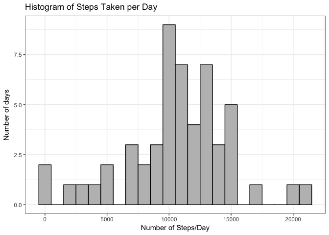
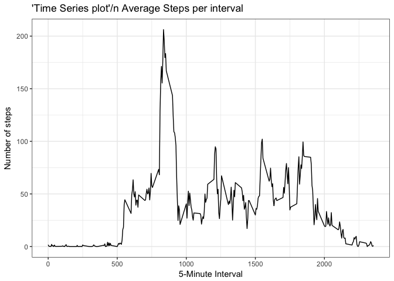
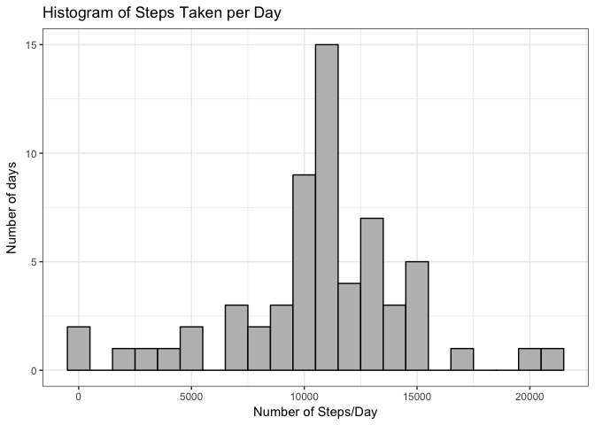
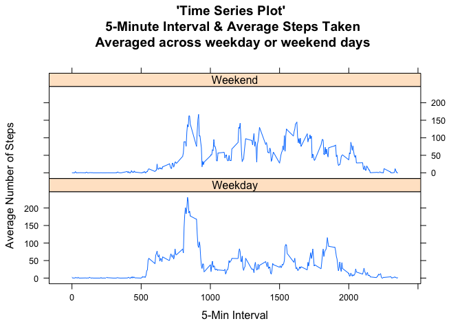

Loading and preprocessing the data
----------------------------------

Loading Data ... **You can also directly download data from this
[Link](https://d396qusza40orc.cloudfront.net/repdata%2Fdata%2Factivity.zip "Link")
**

    # Data Science Specialization: Reproducible Research
    # Course Project 1
    # Vidit Agarwal
    ################################################################################

    rm(list = ls())
    library(dplyr, warn.conflicts = FALSE)
    library(ggplot2)
    library(lattice)

    zipFile <- "Data_PeerAssign1.zip"
    fileUrl <- "https://d396qusza40orc.cloudfront.net/repdata%2Fdata%2Factivity.zip"

    #Setting up folder & files
    if(!file.exists("activity.csv")) {
      download.file(fileUrl, destfile=zipFile, method="curl")
      unzip(zipFile)
      file.remove(zipFile)
    }

    ActivityData <- read.csv("activity.csv", header = TRUE, na.strings = "NA", stringsAsFactors = FALSE) 
    ActivityData$date <- as.Date(ActivityData$date, "%Y-%m-%d")

**Lets observe the structure of file**

     str(ActivityData)  

    ## 'data.frame':    17568 obs. of  3 variables:
    ##  $ steps   : int  NA NA NA NA NA NA NA NA NA NA ...
    ##  $ date    : Date, format: "2012-10-01" "2012-10-01" ...
    ##  $ interval: int  0 5 10 15 20 25 30 35 40 45 ...

     head(ActivityData)  

    ##   steps       date interval
    ## 1    NA 2012-10-01        0
    ## 2    NA 2012-10-01        5
    ## 3    NA 2012-10-01       10
    ## 4    NA 2012-10-01       15
    ## 5    NA 2012-10-01       20
    ## 6    NA 2012-10-01       25

What is mean total number of steps taken per day?
-------------------------------------------------

*Filtering out missing values in dataset and plotting Histogram*

    Totalsteps_Day <- ActivityData %>% filter(!is.na(steps)) %>% 
                        group_by(date) %>% summarise( total_steps = sum(steps))
    ggplot(Totalsteps_Day, aes(x = total_steps)) + 
                   geom_histogram(fill = "grey" ,color = "black", binwidth = 1000) + 
                   labs(title="Histogram of Steps Taken per Day", 
                         x = "Number of Steps/Day", y = "Number of days") +
                   theme_bw()

    steps_mean   <- as.integer(mean(Totalsteps_Day$total_steps, na.rm=TRUE))
    steps_median <- median(Totalsteps_Day$total_steps, na.rm=TRUE)

Therefore, average steps taken per day = **10766**, and median steps =
**10765**

What is the average daily activity pattern?
-------------------------------------------

*Filtering out missing values in dataset and plotting time series plot*

      Avgsteps_Interval <- ActivityData %>% filter(!is.na(steps)) %>% 
                           group_by(interval) %>% summarise( avg_steps = mean(steps))
      g <- ggplot(Avgsteps_Interval, aes(x = interval , y = avg_steps)) 
      g + geom_line() + 
          labs(title="'Time Series plot'/n Average Steps per interval", 
              x = "5-Minute Interval", y = "Number of steps") +
          theme_bw()

    best_interval <- as.integer(Avgsteps_Interval[which.max(Avgsteps_Interval$avg_steps),][1])
    maxsteps <- as.integer(Avgsteps_Interval[which.max(Avgsteps_Interval$avg_steps),][2])

*Time interval in which steps were taken = **835**, steps taken = **206
** *

Imputing missing values
-----------------------

-   **Note**: Values will be imputed using mean of respective
    intervals\*

<!-- -->

      Total_NAs <- sum(is.na(ActivityData$steps))
      Imputed <- merge(ActivityData, Avgsteps_Interval, by = "interval" , by.all = F) 
      Imputed$steps[is.na(Imputed$steps)] <- Imputed$avg_steps[is.na(Imputed$steps)]
      Imputed <- Imputed[names(ActivityData)]

      Totalsteps2_Day <- Imputed%>% filter(!is.na(steps)) %>% 
                         group_by(date) %>% 
                         summarise( total_steps = sum(steps))
      
      ggplot(Totalsteps2_Day, aes(x = total_steps)) + 
      geom_histogram(fill = "grey" ,color = "black", binwidth = 1000) + 
      labs(title="Histogram of Steps Taken per Day", 
           x = "Number of Steps/Day", y = "Number of days") +
      theme_bw()

    steps_mean   <- as.integer(mean(Totalsteps2_Day$total_steps, na.rm=TRUE))
    steps_median <- as.integer(median(Totalsteps2_Day$total_steps, na.rm=TRUE))

Therefore, average steps taken per day = **10766**, and median steps =
**10766**

Are there differences in activity patterns between weekdays and weekends?
-------------------------------------------------------------------------

    Imputed$weekday <- as.factor(ifelse(weekdays(Imputed$date) %in% 
                      c("Sunday", "Saturday"),"Weekend","Weekday"))
    Avgsteps2_Interval <- Imputed  %>% group_by(weekday, interval) %>% summarise( avg_steps = mean(steps))

    with( Avgsteps2_Interval, xyplot( avg_steps ~ interval | weekday, type = "l",layout = c(1,2), 
    main = "'Time Series Plot'\n 5-Minute Interval & Average Steps Taken\n Averaged across weekday or weekend days",
    xlab = "5-Min Interval", ylab = "Average Number of Steps"))

